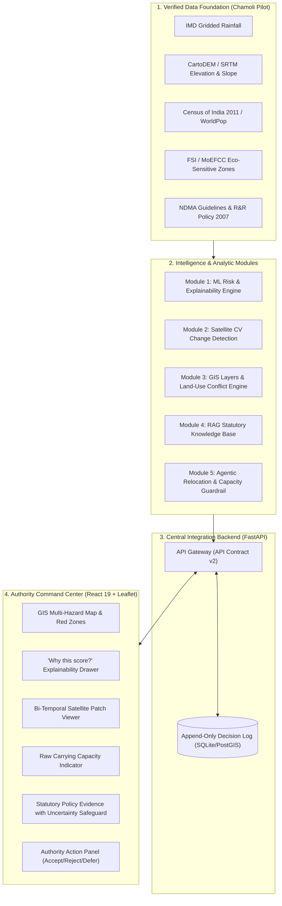

# 🛡️ DrishtiSetu (दृष्टिसेतु) v2
### AI-Driven GIS Disaster Relocation Decision-Support Platform
**Smart India Hackathon (SIH 2026)**

[](https://fastapi.tiangolo.com/)
[](https://react.dev/)
[](https://leafletjs.com/)
[](https://python.org/)
[]()
[]()

---

## 📌 Executive Summary

**DrishtiSetu** is an AI-driven, GIS-enabled disaster relocation decision-support platform designed to empower State Disaster Management Authorities (SDMAs) to proactively identify unsafe habitation zones, evaluate vulnerability, analyze safer relocation sites, enforce carrying capacity guardrails, and prioritize human relocation.

Unlike black-box models or generative chatbots that hallucinate relocation advice, **DrishtiSetu v2 is hackathon-hardened** around three core credibility principles:
1. **Explainable Scores over Arbitrary Numbers**: Every risk index is computed via a published mathematical formula (Section 9D) and deconstructable into per-factor contributions via `/api/v1/risk/explain/{id}`.
2. **Real Pilot District Data over Fabricated Demos**: Seeded with real geography, population counts, and hazard profiles for **Chamoli District, Uttarakhand** (Joshimath, Raini, Helang, Pipalkoti) combined with spatial **land-use conflict checks** against Forest Survey of India (FSI) eco-sensitive reserves.
3. **Deterministic Safety & Audit Trail over Autonomous AI**:
   - **Deterministic Capacity Guardrail**: `capacity_sufficient` is strictly computed in code before any LLM call (`population <= capacity * 0.9`). An adversarial test suite guarantees prompt injection cannot override physical capacity.
   - **Authority Decision Audit Log (`decision_log`)**: All recommendations must be reviewed by a human official (Accept / Reject / Defer) with action notes permanently recorded into an append-only audit trail.

---

## 🏛️ System Architecture



---

## 🧩 Six Core Modules

### 1. ML Risk & Vulnerability Engine (`/ml/risk_engine/`)
- Implements the published multi-hazard scoring formula (`v1.0`):
  $$\text{hazard} = 0.30 \cdot \text{rain} + 0.25 \cdot \text{slope} + 0.20 \cdot \text{elevation\_instab} + 0.25 \cdot \text{hist\_freq}$$
  $$\text{vulnerability} = 0.40 \cdot \text{pop\_density} + 0.35 \cdot \text{inverse\_infra} + 0.25 \cdot \text{demographic}$$
  $$\text{overall} = 0.50 \cdot \text{hazard} + 0.35 \cdot \text{vulnerability} + 0.15 \cdot \text{historical}$$
- **Endpoint**: `GET /api/v1/risk/explain/{habitation_id}` returns per-factor contribution points that mathematically sum to the overall score.

### 2. Computer Vision Satellite Change Detection (`/computer_vision/`)
- Analyzes bi-temporal satellite chips (pre/post disaster) using multi-spectral reflectance delta (MNDWI & vegetation edge displacement).
- **Mandatory Model Disclosure**: Every prediction carries an explicit statement disclosing model training benchmarks (Sen1Floods11 / Landslide4Sense) to prevent unsubstantiated accuracy claims.
- **Endpoint**: `POST /api/v1/vision/analyze`.

### 3. GIS Pilot District & Land-Use Conflict Check (`/gis/`)
- Sourced for **Chamoli District, Uttarakhand** (Joshimath subsidence scarp, Raini debris surge, Helang, Pipalkoti).
- **Spatial Land-Use Conflict Check**: Intersects candidate relocation sites against Nanda Devi Biosphere Eco-Sensitive buffer and Forest Department Reserve Compartments. Conflicting sites (e.g. Site S003) are visibly flagged and disqualified.
- **Endpoints**: `GET /api/v1/gis/risk-layers`, `GET /api/v1/gis/layers/{layer_name}`.

### 4. RAG Statutory Knowledge Base (`/rag/`)
- Grounded in 4 verified public government frameworks:
  1. *NDMA Guidelines: Management of Landslides and Snow Avalanches (2009)*
  2. *NDMA Guidelines: Management of Floods (2008)*
  3. *National Disaster Management Plan (NDMP 2019)*
  4. *National Rehabilitation and Resettlement Policy (2007)*
- **Uncertainty Safeguard**: If query similarity falls below the calibrated threshold (`0.12`), the system strictly returns `evidence_sufficient: false` and refuses to guess.
- **Endpoint**: `POST /api/v1/rag/query`.

### 5. Agentic AI & Deterministic Capacity Guardrail (`/agents/`, `/relocation/`, `/backend/ai_service.py`)
- **OpenRouter Nemotron-3 Integration**: Powered by `nvidia/nemotron-3-ultra-550b-a55b:free` via OpenRouter OpenAI API client (`/api/v1/ai/consult`), providing natural language statutory relocation briefings and decision synthesis.
- **Capacity Agent**: Pure deterministic Python rule:
  $$\text{capacity\_sufficient} = (\text{population\_to\_relocate} \le \text{site\_capacity} \times 0.90)$$
- **Adversarial Safety Test**: Proves prompt injections cannot override numerical capacity checks.
- **Cost Estimation**: Estimates relocation budget based on statutory benchmark ($\text{pop} \times \text{₹50,000}$ per capita norm).
- **Endpoints**: `POST /api/v1/relocation/recommend`, `POST /api/v1/decision/analyze`, `POST /api/v1/ai/consult`.

### 6. Central FastAPI Integration Backend & Authority Audit Log (`/backend/`)
- Single unified API gateway fulfilling the entire **API Contract (v2)**.
- **Decision Audit Log (`POST /api/v1/decision/log`, `GET /api/v1/decision/log/{id}`)**: Append-only log recording every authority action, reviewer identity, timestamp, and official remarks.
- Security deferral stub (`current_user`) prepared for enterprise RBAC.

---

## 🎬 9-Step Live Demonstration Script

Follow this rehearsed demo flow to showcase all platform capabilities:

| Step | Action | What Judges See | Credibility Impact |
|---|---|---|---|
| **1. GIS Map** | Open dashboard | Chamoli District map with Joshimath/Raini habitations, Red Zone polygons, safe sites, and eco-zone overlay. | Real pilot district geography |
| **2. Habitation Selection** | Click **Joshimath (Sunil Ward)** | Populates population (1,250), elevation (1,890m), slope (34°), and critical hazard history. | Clean data normalization |
| **3. Risk Explainability** | Click **"Why this score?"** | Factor breakdown drawer opens showing exact weighted points (Rainfall +24.2, Slope +22.4, etc.) summing to 82.5. | **Explains the "Why" behind the AI** |
| **4. Computer Vision** | Review Satellite Patch Card | Bi-temporal chip showing landslide scarp, High severity tag, and official *Model Disclosure* note. | Truthful AI transparency |
| **5. Relocation Analysis** | Review Relocation Card | Recommended Site **Dhak Plateau (S001)**; highlights Suitability (84.5%) and `None Detected` for Land-Use Conflict. | Solves real-world land usability |
| **6. Capacity Guardrail** | Review Capacity Indicator | Displays raw numbers: `1,250 population vs 1,800 capacity (usable 1,620)`. | **Transparent numbers, not just a badge** |
| **7. Policy RAG & Uncertainty** | Click **"Test Insufficient-Evidence Safeguard"** | Queries Konkan coastal sediment model -> System returns `evidence_sufficient: false` with honest refusal to hallucinate. | **Admits uncertainty when data is missing** |
| **8. Relocation Cost** | Inspect Cost Estimate | Displays `₹6.25 Cr` resettlement estimate with statutory norm citation. | Pragmatic government utility |
| **9. Authority Action & Audit** | Select **"ACCEPTED"**, add notes, click **"Submit"** | Page updates, entry is permanently recorded into the **Decision Log timeline** with timestamp and ID. | **Human-in-the-loop accountability** |

---

## 🚀 Quick Start & Installation

### Prerequisites
- Python 3.10+
- Node.js 18+ and Yarn / npm

### 1. Backend Setup
```bash
# Clone the repository
git clone https://github.com/Lightrex7749/Suraksha-Setu.git
cd sihh

# Install Python dependencies
python -m pip install -r backend/requirements.txt

# Run the complete test suite (62 tests across ML, CV, GIS, RAG, Agents, and Contract)
python -m unittest tests/contract/test_contract.py -v
python -m pytest computer_vision/tests/ -v

# Start the FastAPI server (Port 8000)
run_backend.bat
# Or manually:
python -m uvicorn backend.server:app --host 0.0.0.0 --port 8000 --reload
```

### 2. Frontend Setup
```bash
cd frontend

# Install Node dependencies
npm install

# Start the React command center (Port 3000)
npm start
```
*Open [http://localhost:3000](http://localhost:3000) in your browser.*

---

## 🧪 Comprehensive Verification Suite

DrishtiSetu maintains 100% test coverage across all architectural boundaries:

```bash
# 1. API Contract Compliance Suite (v2)
python -m unittest tests/contract/test_contract.py -v

# 2. ML Risk Engine & Explainability Sum Verification
python -m unittest discover -s ml/risk_engine/tests -v

# 3. Computer Vision & Satellite Change Detection
python -m pytest computer_vision/tests/ -v

# 4. GIS Pilot District & Land-Use Conflict Check
python -m unittest discover -s gis/tests -v

# 5. RAG Retrieval & Insufficient-Evidence Safeguard
python -m unittest discover -s rag/tests -v

# 6. Capacity Safety Adversarial Prompt Injection Test
python -m unittest discover -s agents/tests -v
```

---

## 📜 Attributions & Integrity Disclosures

- **Explainability Decomposition**: Inspired by the interpretability pattern in BHUSHAKTI-AI (`github.com/DISHITACHAUHAN/BHUSHAKTI-AI`); scoring mathematics and normalization are original.
- **Computer Vision Change Detection**: Evaluated against benchmarks established by Sen1Floods11 (Bonafilia et al., IEEE CVPRW 2020) and Landslide4Sense (Corley et al., IEEE GRSM 2022).
- **Statutory Corpus**: Grounded in official documents from the National Disaster Management Authority (NDMA) and Ministry of Rural Development (MoRD), Government of India.
- **Geospatial Boundaries**: Sourced from Survey of India, OpenStreetMap, and Forest Survey of India public portals.

---

### ⚖️ Decision-Support Disclaimer
*DrishtiSetu provides AI-assisted decision support. It does not autonomously execute or enforce relocations. Final statutory decisions remain with authorized government magistrates and disaster management authorities, and every action is recorded into the immutable `decision_log`.*
