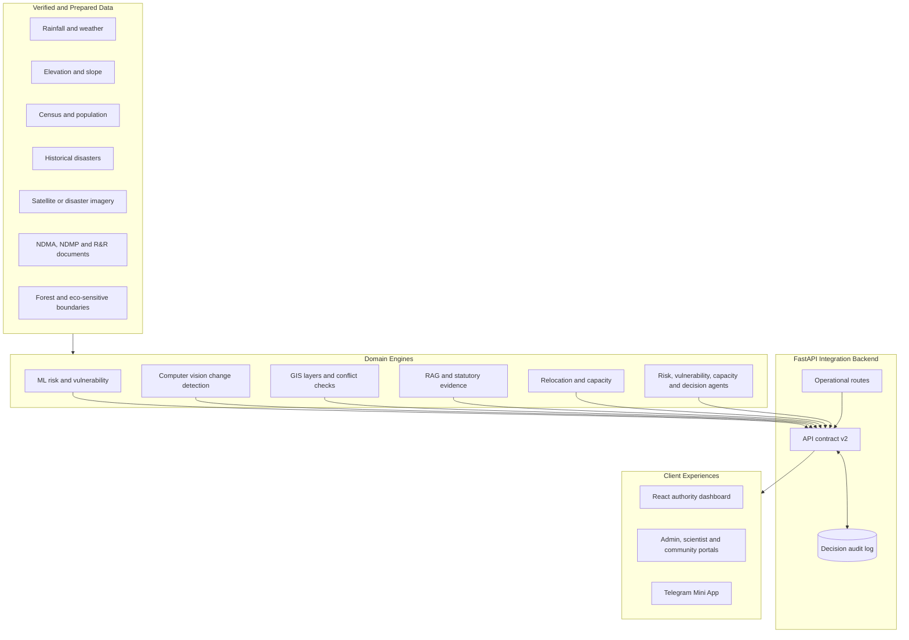
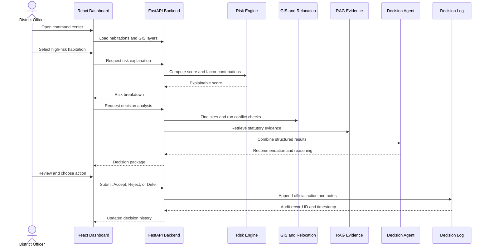

# DrishtiSetu Project Presentation Guide

## 1. Executive Summary

DrishtiSetu is an AI-driven, GIS-enabled disaster relocation decision-support platform for State Disaster Management Authorities (SDMAs), district officers, scientists, and emergency-response teams.

The platform helps an authority move from **hazard observation** to an **explainable, evidence-grounded, capacity-safe relocation decision**:

1. Identify unsafe habitations and multi-hazard exposure.
2. Explain why a habitation has a given risk score.
3. Inspect satellite or disaster-image change indicators.
4. Compare candidate relocation sites.
5. Reject sites with land-use or eco-sensitive conflicts.
6. Check carrying capacity with a deterministic rule.
7. Retrieve statutory guidance with an explicit insufficient-evidence state.
8. Produce a relocation recommendation and cost estimate.
9. Keep the final decision with a human authority and record it in an audit log.

The current pilot is centered on Chamoli District, Uttarakhand, including Joshimath, Raini, Helang, and Pipalkoti.

> **Decision-support boundary:** DrishtiSetu assists authorized officials. It does not autonomously order, enforce, or execute relocation.

---

## 2. The Problem

Disaster relocation decisions are difficult because the evidence is distributed across maps, hazard data, historical events, population vulnerability, imagery, policy documents, and infrastructure constraints.

A practical authority needs more than a risk number. The authority needs to know:

- Which habitation is at risk?
- Which factors created the score?
- What has changed in recent imagery?
- Which relocation sites are physically and legally usable?
- Can the selected site accommodate the affected population?
- What statutory guidance supports the recommendation?
- What action did the responsible official finally take?

DrishtiSetu brings these questions into a single operational dashboard and API contract.

---

## 3. Product Positioning

### Primary users

| User | Main need | DrishtiSetu capability |
| --- | --- | --- |
| District Disaster Management Officer | Make and justify relocation decisions | Decision analysis, map, explainability, audit log |
| SDMA planning team | Compare multiple habitations and sites | Risk, GIS layers, relocation scoring, cost estimates |
| Field and emergency teams | Understand current hazard signals | Alerts, weather, disaster and imagery workflows |
| Scientists and analysts | Inspect data and model outputs | Datasets, analytics, simulations, model import/export |
| Community and citizens | Report incidents and receive information | Community posts, notifications, Telegram Mini App |
| Administrators | Operate and govern the platform | User, alert, report, safety, broadcast and log APIs |

### Differentiators

1. **Explainable risk:** factor contributions can be inspected instead of accepting a black-box score.
2. **Deterministic safety guardrail:** capacity sufficiency is computed in code before any language-model response.
3. **Land-use conflict awareness:** candidate sites can be disqualified for forest, eco-sensitive, or existing-settlement conflicts.
4. **Evidence honesty:** RAG returns `evidence_sufficient: false` when retrieval does not support a reliable answer.
5. **Human accountability:** Accept, Reject, and Defer actions are permanently recorded.
6. **Operational breadth:** the same backend also exposes alerts, weather, community, scientist, admin, and Telegram features.

---

## 4. System Architecture



### Architectural layers

#### Layer 1: React client

The frontend is a React 19 application started through CRACO. The primary route renders `DrishtiDashboard`; additional routes support authentication, alerts, weather, disasters, community, analytics, student, scientist, admin, profile, and Telegram experiences.

The client is responsible for visualization, interaction, language selection, notifications, and API consumption. Decision logic remains in the backend.

#### Layer 2: FastAPI integration backend

`backend/server.py` is the production entrypoint and imports the central application from `backend/drishti_server.py`.

The backend provides:

- Request validation through Pydantic.
- Central composition of ML, CV, GIS, RAG, relocation, and agent outputs.
- CORS for the dashboard.
- Health and OpenAPI endpoints.
- A future RBAC dependency stub.
- Append-only decision logging.

#### Layer 3: Analytics and intelligence

The domain modules are independently organized and exposed through stable API shapes:

- `ml/risk_engine/`: risk scoring and explanation.
- `computer_vision/`: image and satellite-patch analysis.
- `gis/`: habitations, GeoJSON layers, candidate sites, and conflicts.
- `rag/`: retrieval, evidence sufficiency, sources, and answer generation.
- `relocation/`: candidate-site selection and cost/capacity calculations.
- `agents/`: decision coordination and safety rules.

#### Layer 4: Persistence and audit

The project includes database, migration, and decision-log components. The authority decision log records habitation, reviewer, action, notes, recommendation identity, and timestamps. Operational data can use the broader database and warehouse services documented in the repository.

---

## 5. Feature Architecture

### 5.1 GIS command center

The map is the visual anchor for the authority workflow. It can combine:

- Habitation points.
- Red-zone or hazard polygons.
- Relocation-site points.
- Land-use conflict overlays.
- Location and infrastructure context.

The live API exposes a risk-layer manifest and GeoJSON layer endpoints. This lets the frontend load layers independently and preserve a stable map contract.

Key endpoints:

- `GET /api/v1/gis/risk-layers`
- `GET /api/v1/gis/layers/{layer_name}`
- `GET /api/v1/habitations`
- `GET /api/v1/habitations/{habitation_id}`

### 5.2 Risk and vulnerability engine

The risk engine combines normalized hazard, vulnerability, and historical components. The documented v1 formula is:

$$
H = 0.30R + 0.25S + 0.20E + 0.25F
$$

$$
V = 0.40P + 0.35I + 0.25D
$$

$$
O = 0.50H + 0.35V + 0.15T
$$

Where:

- $R$ is rainfall intensity.
- $S$ is slope exposure.
- $E$ is elevation or terrain instability.
- $F$ is historical event frequency.
- $P$ is population-density vulnerability.
- $I$ is inverse infrastructure access.
- $D$ is demographic vulnerability.
- $T$ is the historical component.
- $O$ is the overall risk score.

The API returns risk level and relocation priority. The explanation endpoint returns factor-level contributions, raw values, weights, formula version, and methodology reference.

Key endpoints:

- `POST /api/v1/risk/analyze`
- `GET /api/v1/risk/explain/{habitation_id}`

### 5.3 Computer vision and change detection

The CV module analyzes a supplied image or satellite patch for disaster indicators such as landslides, floods, coastal erosion, cloudburst impact, and infrastructure damage.

The response is structured and includes a mandatory model disclosure. This prevents the product from presenting an unsupported accuracy claim as fact.

Key endpoints:

- `POST /api/v1/vision/analyze`
- `GET /api/v1/vision/health`
- `GET /api/v1/vision/demo-samples`

### 5.4 GIS suitability and land-use conflict

Candidate relocation sites are assessed using suitability signals such as accessibility, infrastructure, residual hazard, and capacity. A spatial conflict check can identify overlap with:

- Eco-sensitive zones.
- Forest or reserve compartments.
- Existing settlements.
- Other protected or unavailable land-use areas.

A site with a conflict should be visibly flagged and excluded or downgraded rather than hidden inside a composite score.

### 5.5 RAG statutory evidence

The RAG pipeline retrieves relevant excerpts from disaster-management and rehabilitation documents, then returns answer text plus source metadata.

The response contract has two important states:

- `evidence_sufficient: true`: answer is supported by retrieved material and sources are returned.
- `evidence_sufficient: false`: the system explicitly declines to provide an unsupported answer.

Key endpoint:

- `POST /api/v1/rag/query`

The intended corpus includes NDMA landslide and flood guidance, the National Disaster Management Plan, and the National Rehabilitation and Resettlement Policy.

### 5.6 Relocation engine

The relocation engine selects a candidate site and returns:

- Site identity.
- Suitability score.
- Site capacity.
- Population to relocate.
- Capacity sufficiency.
- Land-use conflict state.
- Estimated cost.
- Recommendation and lifecycle status.

The cost basis follows the documented pilot benchmark:

$$
\text{estimated cost} = \text{population to relocate} \times ₹50{,}000
$$

Key endpoint:

- `POST /api/v1/relocation/recommend`

### 5.7 Deterministic capacity guardrail

Capacity is not generated by an LLM. The rule is:

$$
\text{capacity\_sufficient} =
(\text{population\_to\_relocate} \leq 0.90 \times \text{site\_capacity})
$$

The 90% usable-capacity buffer protects against recommending a site that is technically large enough but operationally overcrowded. The language model may explain the result, but it may not contradict it.

### 5.8 Agentic decision synthesis

The agent layer coordinates structured outputs from risk, relocation, capacity, and RAG modules. It is an orchestration layer, not a replacement for the deterministic engines.

The central decision endpoint combines:

- Habitation identity and population.
- Risk score and risk level.
- Relocation priority.
- Recommended site.
- Suitability and capacity.
- Land-use conflict.
- Evidence and source metadata.
- Cost estimate.
- Human review requirement.

Key endpoint:

- `POST /api/v1/decision/analyze`

### 5.9 AI consultation

The optional AI advisor uses OpenRouter through the OpenAI SDK and has model fallbacks. It receives structured habitation and decision context, with system rules that preserve physical capacity and statutory grounding. If external model access is unavailable, the service returns a deterministic offline fallback.

Key endpoint:

- `POST /api/v1/ai/consult`

### 5.10 Authority audit log

The final decision is made by an authorized official through three actions:

- `ACCEPTED`
- `REJECTED`
- `DEFERRED`

The action includes reviewer identity and notes and is retrieved chronologically by habitation or across the full system.

Key endpoints:

- `POST /api/v1/decision/log`
- `GET /api/v1/decision/log`
- `GET /api/v1/decision/log/{habitation_id}`

### 5.11 Operational platform features

Beyond the core relocation workflow, the live backend registers APIs for:

- Weather, rainfall trends, AQI, cyclone, and flood risk.
- Disaster incidents and alerts.
- Community posts, messages, notifications, reports, and verification.
- Scientist datasets, coverage, simulations, analytics, model import/export, and data ingestion.
- Administrator users, broadcasts, reports, logs, safety status, and Telegram operations.
- Telegram Mini App registration and chat integration.
- Profiles, saved locations, contacts, and authentication-related flows.

These features make DrishtiSetu an operational platform rather than a single static scoring demo.

---

## 6. End-to-End Authority Workflow



### Detailed workflow

1. **Load context:** fetch habitations and map layers.
2. **Select a habitation:** show location, population, hazard type, elevation, slope, and history.
3. **Explain risk:** calculate and display factor contributions.
4. **Inspect imagery:** show pre/post change indicators and model disclosure.
5. **Evaluate relocation:** rank candidate sites and show conflict status.
6. **Check capacity:** show raw population, total site capacity, usable capacity, and boolean result.
7. **Retrieve evidence:** show policy answer and sources or the insufficient-evidence state.
8. **Synthesize decision:** combine risk, GIS, capacity, cost, and policy context.
9. **Review officially:** authority chooses Accept, Reject, or Defer and records notes.
10. **Audit:** display the append-only history for future review.

---

## 7. Live Demo Script

Use `H001`, Joshimath (Sunil Ward), as the primary demonstration record when the seeded pilot data is available.

| Step | Demonstration action | Expected story |
| ---: | --- | --- |
| 1 | Open `/` or `/drishti` | Authority command center opens. |
| 2 | Load the Chamoli map | Habitational, red-zone, relocation, and conflict layers appear. |
| 3 | Select Joshimath (Sunil Ward) | Population, elevation, slope, hazard and history become visible. |
| 4 | Open risk explanation | Score decomposes into weighted, inspectable factors. |
| 5 | Open imagery analysis | Change indicator and model disclosure are visible. |
| 6 | Open relocation recommendation | Site suitability, conflict, capacity, and cost are visible together. |
| 7 | Test RAG with a supported question | Answer includes evidence and source metadata. |
| 8 | Test an unrelated or unsupported question | System returns `evidence_sufficient: false` instead of guessing. |
| 9 | Submit an authority action | Accept, Reject, or Defer appears in the audit history. |

### Strong proof points for a presentation

- Show the raw capacity numbers, not only a green or red label.
- Open the risk explanation and point out that contributions add up to the displayed score.
- Show a candidate with a land-use conflict and explain why it is not recommended.
- Demonstrate the RAG refusal path as a positive safety feature.
- Show the final audit entry with reviewer and notes.

---

## 8. API Map

| Domain | Main endpoints |
| --- | --- |
| Health | `GET /health` |
| Habitations | `GET /api/v1/habitations`, `GET /api/v1/habitations/{id}` |
| Risk | `POST /api/v1/risk/analyze`, `GET /api/v1/risk/explain/{id}` |
| Vision | `POST /api/v1/vision/analyze`, `GET /api/v1/vision/demo-samples` |
| GIS | `GET /api/v1/gis/risk-layers`, `GET /api/v1/gis/layers/{name}` |
| RAG | `POST /api/v1/rag/query` |
| Relocation | `POST /api/v1/relocation/recommend` |
| Decision | `POST /api/v1/decision/analyze` |
| Audit | `POST /api/v1/decision/log`, `GET /api/v1/decision/log/{id}` |
| AI advisor | `POST /api/v1/ai/consult` |
| Operations | `/api/*`, `/admin/*`, and `/api/telegram/*` route families |

The complete live route list is available from `GET /openapi.json` while the backend is running.

---

## 9. Data and Evidence Architecture

### Pilot geography

The pilot data models Chamoli District, Uttarakhand, with named habitations and relocation sites. The repository documentation identifies Joshimath, Raini, Helang, and Pipalkoti as the primary demonstration context.

### Named data families

- IMD or rainfall observations and gridded products.
- CartoDEM or SRTM elevation and terrain derivatives.
- Census of India and population datasets.
- Historical disaster records.
- Forest Survey of India and eco-sensitive boundaries.
- Satellite or aerial imagery for change detection.
- NDMA, NDMP, and rehabilitation and resettlement documents.

### Data-quality rules

- Label mock or seeded data clearly.
- Keep source and page metadata with retrieved policy evidence.
- Never report an unevaluated accuracy number.
- Never let an LLM override numeric safety rules.
- Preserve the difference between a model prediction, a retrieved fact, and an authority decision.

---

## 10. Security, Governance, and Safety

### Current safeguards

- Pydantic request validation.
- CORS middleware for the dashboard.
- Future-authentication dependency stub (`get_current_user_stub`).
- Deterministic capacity calculation.
- Evidence sufficiency threshold and refusal path.
- Model disclosure in CV output.
- Human-in-the-loop decision actions.
- Append-only authority decision history.

### Production hardening required

The current hackathon scope leaves authentication as a prepared dependency stub. A production deployment should add:

- Real identity provider integration and role-based access control.
- District and organization-level authorization.
- Secret management for OpenRouter, Firebase, database, messaging, and storage credentials.
- Strict CORS origins instead of wildcard access.
- Audit-log integrity controls and retention policy.
- Rate limiting, request tracing, structured logging, and alerting.
- Data minimization and protection for population and location information.
- Backup, disaster recovery, and database migration procedures.

---

## 11. Repository Map

| Area | Purpose |
| --- | --- |
| `backend/server.py` | Production FastAPI entrypoint |
| `backend/drishti_server.py` | Central API composition and route registration |
| `backend/ai_service.py` | OpenRouter consultation and fallback behavior |
| `backend/drishti_db.py` | Decision-log persistence and retrieval |
| `ml/` | Risk scoring and explainability |
| `computer_vision/` | Image analysis service, schemas, and routes |
| `gis/` | Pilot geography, layers, and spatial services |
| `rag/` | Retrieval, evidence checks, and answer generation |
| `agents/` | Capacity, risk, relocation, vulnerability, and decision agents |
| `relocation/` | Candidate-site selection and recommendations |
| `frontend/src/App.js` | React route composition |
| `frontend/src/pages/DrishtiDashboard*` | Primary authority experience |
| `docs/API_CONTRACT.md` | API response and request contract |
| `docs/ARCHITECTURE.md` | System-level design rules |
| `docs/DATA_SOURCES.md` | Data and scoring source documentation |
| `docs/DEMO_FLOW.md` | Existing demo-oriented flow material |

---

## 12. Local Setup and Runbook

### Prerequisites

- Python 3.10 or newer.
- Node.js 18 or newer.
- npm or Yarn.
- Python dependencies from `backend/requirements.txt`.
- Node dependencies from `frontend/package.json`.

### Backend setup

From the repository root:

```powershell
python -m pip install -r backend/requirements.txt
python -m uvicorn backend.server:app --host 127.0.0.1 --port 8000
```

Open:

- Health: `http://127.0.0.1:8000/health`
- OpenAPI JSON: `http://127.0.0.1:8000/openapi.json`
- Swagger UI: `http://127.0.0.1:8000/docs`

### Frontend setup

In a second terminal:

```powershell
Set-Location frontend
npm install
npm start
```

Open `http://localhost:3000` after the development server reports that compilation has completed.

### Environment variables

Common optional integrations include:

- `OPENROUTER_API_KEY`
- `OPENROUTER_BASE_URL`
- `OPENROUTER_MODEL`
- `DATABASE_URL` or `POSTGRES_URL`
- Firebase, messaging, storage, and external weather or data-provider settings documented in the repository environment examples.

The AI consultation path has an offline deterministic fallback when model access is unavailable.

---

## 13. Verification Checklist

### Backend

```powershell
python -m pip check
python -m pytest backend/tests -q
```

Run the broader targeted suites when dependencies and data fixtures are available:

```powershell
python -m pytest computer_vision/tests -q
python -m unittest discover -s agents/tests -v
```

### Frontend

```powershell
Set-Location frontend
npm run build
npm test -- --watchAll=false
```

### Runtime smoke checks

```powershell
Invoke-WebRequest http://127.0.0.1:8000/health
Invoke-WebRequest http://127.0.0.1:8000/api/v1/habitations
Invoke-WebRequest http://127.0.0.1:8000/api/v1/gis/risk-layers
```

For the full API contract, use the repository's contract tests and inspect the generated OpenAPI document.

---

## 14. Verification Snapshot for This Guide

The following checks were run while preparing this document:

- Backend started with `python -m uvicorn backend.server:app --host 127.0.0.1 --port 8000`.
- `GET /health` returned HTTP 200 and `{"status":"ok","service":"drishtisetu"}`.
- `GET /openapi.json` returned the registered route catalog.
- `GET /api/v1/habitations` returned seeded habitation data including `H001`.
- `GET /api/v1/gis/risk-layers` returned the four-layer manifest.
- `POST /api/v1/decision/analyze` for `H001` returned risk, relocation, capacity, land-use conflict, cost, reasoning, evidence, and recommendation fields.
- Frontend dependencies are installed under `frontend/node_modules`.
- The frontend process was launched from `frontend` with `npm start`; the first immediate HTTP probe occurred before CRA finished binding to port 3000, so the browser URL should be checked after compilation completes.

This snapshot is intentionally time-bound. The API response values can change as seeded data, configuration, or model integrations change.

---

## 15. Presentation Narrative

### Opening

"DrishtiSetu turns fragmented disaster evidence into an explainable relocation decision while keeping the final authority with a human officer."

### Middle

"The map shows where the risk is. The risk engine explains why. Computer vision adds observed change. GIS checks whether a site is actually usable. RAG grounds the recommendation in policy and admits when evidence is missing. The capacity guardrail protects the decision from optimistic language-model output."

### Close

"The system does not hide uncertainty or automate statutory authority. It produces a traceable decision package and records what the responsible official decided."

### Suggested slide sequence

1. Disaster relocation decision gap.
2. DrishtiSetu product promise.
3. User roles and operating context.
4. End-to-end architecture.
5. GIS command center.
6. Explainable risk engine.
7. Computer vision change detection.
8. Relocation suitability and land-use conflicts.
9. Deterministic capacity guardrail.
10. RAG evidence and insufficient-evidence safeguard.
11. Agentic decision synthesis.
12. Authority action and audit log.
13. Wider operational features.
14. Technology and repository architecture.
15. Live demo flow.
16. Security, governance, and roadmap.
17. Impact and closing statement.

---

## 16. Roadmap

### Near term

- Complete real authentication and RBAC.
- Connect production PostGIS and expand verified district data.
- Add automated ingestion monitoring and data freshness indicators.
- Complete frontend smoke tests and API contract tests in CI.
- Improve model evaluation reporting with reproducible benchmark runs.

### Medium term

- Add more districts and state-specific policy corpora.
- Add streaming alerts and scheduled data refreshes.
- Add richer satellite time-series analysis.
- Add multilingual statutory explanations and accessibility improvements.
- Add authority collaboration, review queues, and escalation workflows.

### Long term

- Calibrated multi-hazard forecasting.
- Cross-district capacity planning.
- Scenario simulation for phased relocation.
- Production-grade MLOps, monitoring, and model governance.
- Interoperability with state and national disaster-management systems.

---

## 17. Final Takeaway

DrishtiSetu is best presented as a **trustworthy decision-support system for disaster relocation**:

- It is spatially grounded.
- It explains its risk scores.
- It distinguishes evidence from generated language.
- It refuses unsupported policy answers.
- It uses deterministic physical safety checks.
- It keeps people and institutions accountable for the final decision.

That combination is the project's core architecture and its strongest story for a detailed presentation.
